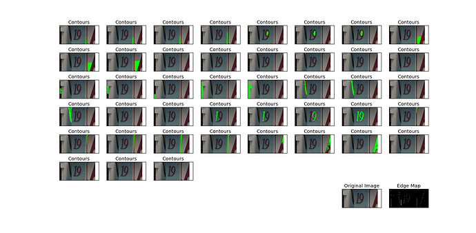
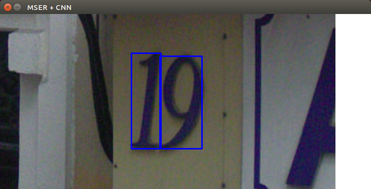

# SVHN-deep-cnn-digit-detector

This project implements deep-cnn-detector (and recognizer) in natural scene. I used keras framework and opencv library to build the detector.
This detector determine digit or not with CNN classifier for the region proposed by the MSER algorithm.

## Prerequisites

* python 2.7
* numpy 1.12.0
* opencv 2.4.10
* keras 1.2.0
* tensorflow 1.0.0-alpha

## Usage

The procedure to build digit detector is as follows:

### 1. load training samples (1_sample_loader.py)

Svhn provides cropped training samples in matlab format. 
However, it is not suitable for detecting bounding box because it introduces some distracting digits to the sides of the digit of interest. So I collected the training samples directly using full numbers images and its annotation file.

* Train samples : (457723, 32, 32, 3)
* Validation samples : (113430, 32, 32, 3)

### 2. train classifier (2_train.py)

#### 2.1. classifier used for detection

I designed a Convolutional Neural Network architecture for detecting character. This network classify text and non-text.

The architecture is as follows:

* INPUT: [32x32x1]
* CONV3-32: [32x32x32]
* CONV3-32: [32x32x32]
* POOL2: [16x16x32]
* CONV3-64: [16x16x64]
* CONV3-64: [16x16x64]
* POOL2: [8x8x64]
* FC: [1x1x1024] 
  * I used drop out in this layer.
* FC: [1x1x2]
  
The accuracy of the classifier is as follows

* Training Accuracy : 97.91%
* Test Accuracy : 96.98%

#### 2.2. classifier used for recognition

This Convolutional Neural Network recognize numbers. The architecture is same except for the number of class.

The architecture is as follows:

* INPUT: [32x32x1]
* CONV3-32: [32x32x32]
* CONV3-32: [32x32x32]
* POOL2: [16x16x32]
* CONV3-64: [16x16x64]
* CONV3-64: [16x16x64]
* POOL2: [8x8x64]
* FC: [1x1x1024] 
  * I used drop out in this layer.
* FC: [1x1x10]
  * number of class is 10.

The accuracy of the classifier is as follows

* Training Accuracy : 95.41%
* Test Accuracy : 94.52%

### 3. Run the detector (3_detect.py)

In the running time, the detector operates in the 2-steps.

1) The detector finds candidate region proposed by the MSER algorithm.

2) The classifier determines whether or not it is a number in the proposed region.

### 4. Evaluate the detector (4_evaluate.py)

#### 4.1. Performance of the MSER proposer

* recall value : 0.630
* precision value : 0.045
* f1_score : 0.084

#### 4.1. Performance of the MSER+CNN detector

* recall value : 0.513
* precision value : 0.714
* f1_score : 0.597
    

