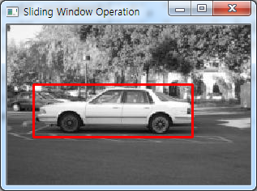
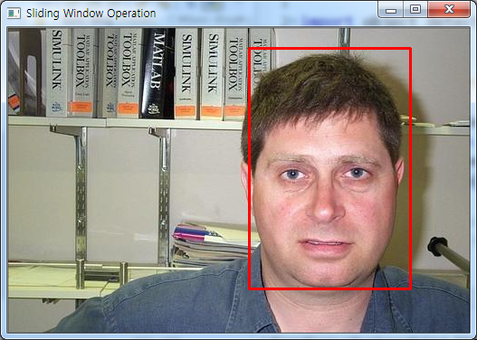
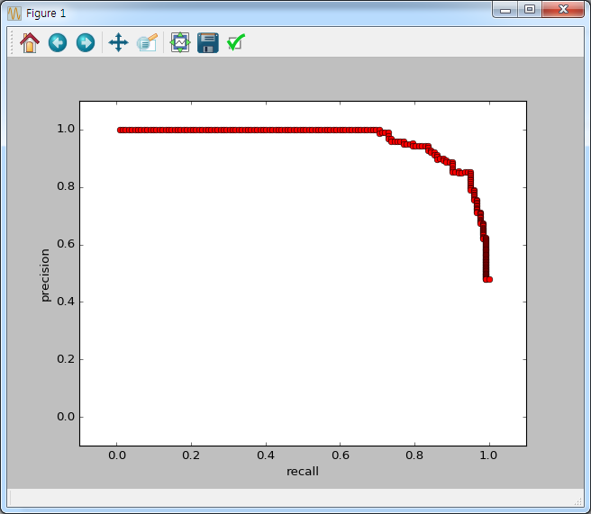

# object-detector

This project implements basic object detection framework using python.

References for building this project is [pyimagesearch](https://gurus.pyimagesearch.com/).

## 1. Quick Start with default configuration file

### 1) Download dataset

* Download [Caltech-101](http://www.vision.caltech.edu/Image_Datasets/Caltech101/101_ObjectCategories.tar.gz)
* Download [houses](http://www.robots.ox.ac.uk/~vgg/data/houses/houses.tar) : This dataset will be used as the negative images

### 2) Extract dataset files

* Extract dataset files.
* Locate dataset directory as the following structure.

```
|--- [Project Directory]
|--- [datasets]
        |--- [caltech101]
                |--- [101_ObjectCategories]
                |--- [Annotations]
        |--- [houses]
```

### 3) Confirm the path of the dataset

Run "0_check_dataset_path.py". If you can find the following message, you can go to the next step.

```
c:\object-detector>python 0_check_dataset_path.py
Positive dataset location is correct
Negative dataset location is correct
```


### 4) Run the main driver

Run "main.py". It will automatically build object-detector with the 7-step framework.

#### 4.1) Displayed Test Image

After finishing step 6, you can see the following test image and recognized bounding box.
 

In the case of using **faces.conf** we can see the following test image and recognized bounding box.


#### 4.2) Average-Precision Evaluation

AP(Average Precision) is a measure of evaluating object detector. After finishing step 7, object detector's average precision score will be printed like this

```
Average Precision : 0.937441470843
```

It is also displayed [precision-recall curve](https://en.wikipedia.org/wiki/Precision_and_recall).



## 2. Build other object detectors in Caltech-101

It is easily build other detector. It is needed just 3-steps.

* Write configuration file like ```Project/Directory/conf/car_side.conf``` or ```Project/Directory/conf/faces.conf```
* In the main.py change CONFIG_FILE parameter
* Run the main.py
